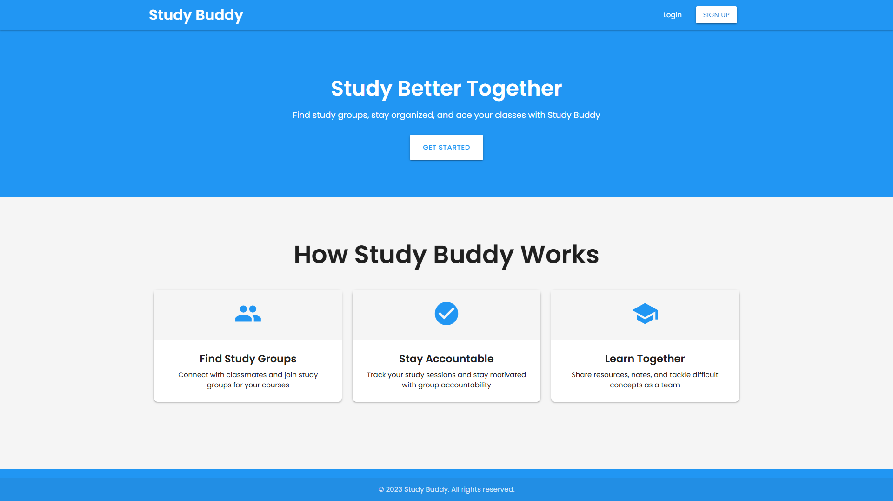
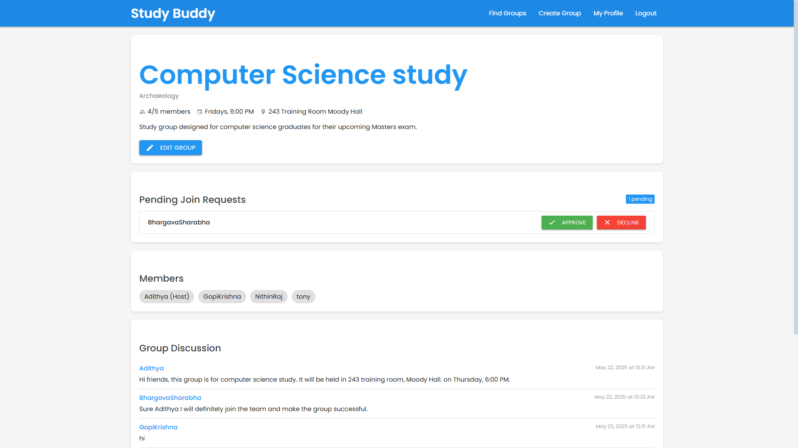
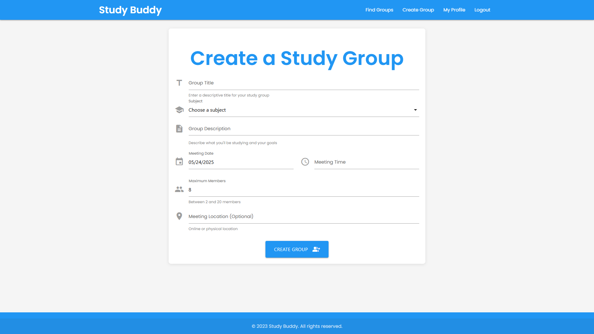
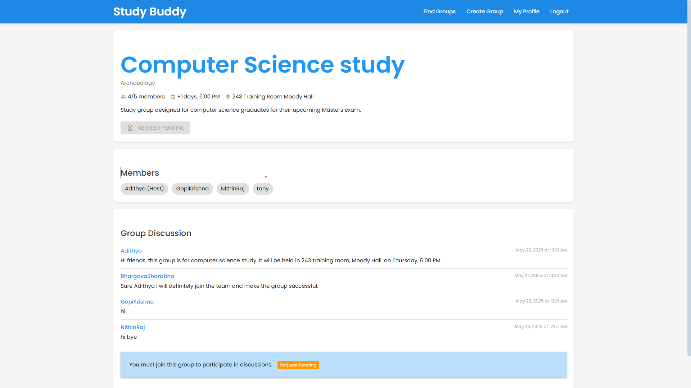
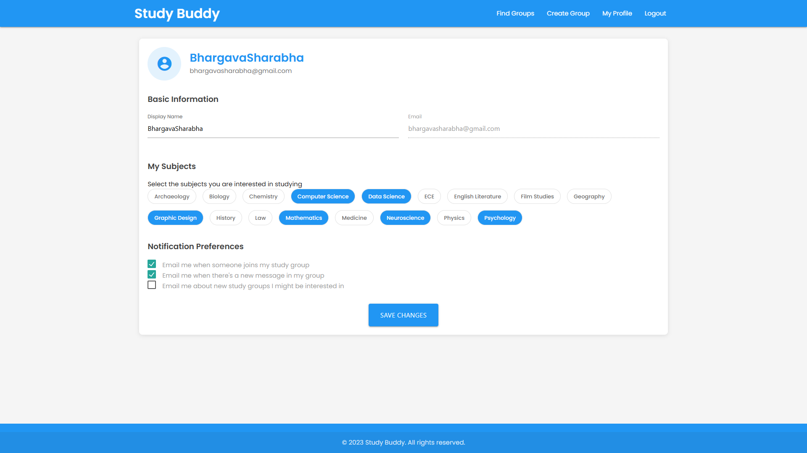

# StudyBuddy - Collaborative Learning Platform



## Overview

StudyBuddy is a web-based collaborative learning platform that connects students with similar academic interests. It enables users to create, join, and manage study groups organized by subject, schedule group sessions, and collaborate through real-time discussions. The platform streamlines the process of finding study partners and provides tools for effective group study management.

## Live Demo

[Live Demo](https://studybuddy-demo.herokuapp.com) - *Coming Soon*

## Key Features

### User Authentication System
- Secure registration and login functionality with custom user model
- Comprehensive user profile creation and management
- Password reset capabilities
- Profile completion tracking and setup wizard

### Study Group Management
- Create study groups with detailed information (subject, schedule, location)
- Browse available study groups with advanced filtering by subject and search
- Robust membership request and approval system for group joining
- Group editing capabilities for hosts with capacity validation
- **Enhanced Join Group System** - Handles all edge cases including rejoining after leaving

### Interactive Dashboards
- User-specific dashboard showing joined groups with membership status
- Group-specific dashboards with comprehensive member information
- Real-time status updates on group activities and pending requests
- **Improved Profile Dashboard** - Displays user's study groups with detailed information

### Real-time Group Discussions
- In-group messaging system with chronological ordering
- Message display with user attribution and timestamps
- Seamless message posting interface for members and hosts

### User Profile System
- Subject interest selection with interactive chip interface
- **Enhanced Profile Management** - Bio field, notification preferences
- User activity tracking and membership history
- Profile customization with study preferences

### Administrative Tools
- **Database Cleanup Commands** - Automated cleanup of redundant join requests
- Comprehensive admin interface for all models
- Data integrity validation and maintenance tools

## Technologies Used

### Backend
- **Python 3.11** - Core programming language
- **Django 5.2** - Web framework for rapid development
- **SQLite** - Database for development (can be migrated to PostgreSQL for production)
- **Django ORM** - Object-Relational Mapping for database interactions
- **Custom User Model** - Extended authentication system

### Frontend
- **HTML5/CSS3** - Structure and styling
- **Materialize CSS** - Modern and responsive UI components
- **JavaScript** - Client-side interactivity and form handling
- **Material Icons** - Visual iconography

### Security Features
- **CSRF Protection** - Cross-Site Request Forgery prevention
- **Password Hashing** - Secure password storage
- **Django Security Middleware** - Protection against common vulnerabilities
- **Permission-Based Access Control** - Role-based access to features
- **Data Validation** - Comprehensive input validation and sanitization

### DevOps & Deployment
- **Git/GitHub** - Version control
- **Virtual Environment** - Dependency isolation
- **Requirements.txt** - Dependency management
- **Django Management Commands** - Custom administrative tools

## Technical Implementation Details

### Database Schema

The application utilizes a relational database with the following key models:

- **CustomUser Model** (Extended Django User)
  - Email-based authentication
  - Enhanced user management
  - Profile relationships

- **Profile Model**
  - User preferences and settings
  - Subject interests (Many-to-Many)
  - Bio and notification preferences
  - Profile completion tracking

- **StudyGroup Model**
  - Title, description, and meeting details
  - Subject categorization (Foreign Key)
  - Host management (User Foreign Key)
  - Members (Many-to-Many through GroupMembership)
  - Capacity management and validation

- **GroupMembership Model**
  - Tracks active membership relationships
  - Stores membership dates and status
  - Handles membership lifecycle

- **GroupJoinRequest Model**
  - **Enhanced Approval Workflow** - Handles all request states
  - Tracks request status (pending, approved, declined)
  - Timestamps for requests and responses
  - **Unique Constraint Handling** - Prevents duplicate requests

- **GroupMessage Model**
  - Message content storage with timestamps
  - User attribution and group relationships
  - Chronological ordering system

- **Subject Model**
  - Academic subject categories
  - Relationships to users and groups

### Core Functionality Implementation

#### Enhanced Group Membership System
The system implements a robust membership request and approval workflow with comprehensive error handling:

```python
# Updated join request system with enhanced error handling
@login_required
def join_group(request, group_id):
    try:
        group = StudyGroup.objects.get(id=group_id)
        
        # Comprehensive constraint checking
        if group.members.filter(id=request.user.id).exists():
            messages.warning(request, "You are already a member of this group.")
        elif GroupJoinRequest.objects.filter(user=request.user, group=group, status='pending').exists():
            messages.info(request, "You already have a pending request to join this group.")
        elif group.is_full:
            messages.error(request, "This group is already full.")
        else:
            # Handle ANY existing request (approved, declined, etc.)
            existing_request = GroupJoinRequest.objects.filter(
                user=request.user, 
                group=group
            ).first()
            
            if existing_request:
                # Update existing request to pending (handles rejoining scenarios)
                existing_request.status = 'pending'
                existing_request.requested_at = timezone.now()
                existing_request.responded_at = None
                existing_request.save()
                messages.success(request, f"Your request to join {group.title} has been submitted!")
            else:
                # Create new request with comprehensive error handling
                try:
                    GroupJoinRequest.objects.create(
                        user=request.user,
                        group=group,
                        status='pending'
                    )
                    messages.success(request, f"Your request to join {group.title} has been sent!")
                except Exception as e:
                    # Fallback handling for edge cases
                    existing_request = GroupJoinRequest.objects.filter(
                        user=request.user, group=group
                    ).first()
                    if existing_request:
                        existing_request.status = 'pending'
                        existing_request.save()
                        messages.success(request, "Your request has been submitted!")
                    else:
                        messages.error(request, "An error occurred. Please try again.")
    except StudyGroup.DoesNotExist:
        messages.error(request, "Study group not found.")
    
    return redirect('group_details', group_id=group_id)
```

#### Real-time Group Discussion
The messaging system implements real-time updates with chronological ordering:

```python
# Enhanced messaging system with proper permissions
@login_required
def group_details(request, group_id=None):
    if group_id:
        group = StudyGroup.objects.get(id=group_id)
        
        # Enhanced permission checking
        is_member = group.members.filter(id=request.user.id).exists()
        is_host = group.host == request.user
        has_pending_request = GroupJoinRequest.objects.filter(
            user=request.user, group=group, status='pending'
        ).exists()
        
        # Get messages with proper ordering
        messages_list = group.messages.all().order_by('timestamp')
        
        # Handle message posting with validation
        if request.method == 'POST' and (is_member or is_host):
            message_content = request.POST.get('message')
            if message_content:
                GroupMessage.objects.create(
                    group=group,
                    user=request.user,
                    content=message_content
                )
                return redirect('group_details', group_id=group.id)
```

#### Enhanced Profile Management
The profile system now includes comprehensive user preference management:

```python
# Enhanced profile view with membership display
@login_required
def profile(request):
    user = request.user
    user_profile = user.profile
    
    # Get user's group memberships for display
    memberships = GroupMembership.objects.filter(
        user=user, is_active=True
    ).select_related('group', 'group__subject')
    
    # Handle profile updates including bio and preferences
    if request.method == 'POST':
        # Update bio field
        bio = request.POST.get('bio')
        if bio is not None:
            user_profile.bio = bio
        
        # Update subject preferences
        selected_subject_ids = request.POST.getlist('selected_subjects[]')
        if selected_subject_ids:
            user_profile.subjects.clear()
            for subject_id in selected_subject_ids:
                try:
                    subject = Subject.objects.get(id=subject_id)
                    user_profile.subjects.add(subject)
                except Subject.DoesNotExist:
                    continue
        
        user_profile.save()
        messages.success(request, "Your profile has been updated!")
    
    context = {
        'user': user,
        'profile': user_profile,
        'memberships': memberships,  # Now displays user's groups
        'subjects': Subject.objects.all().order_by('name')
    }
    
    return render(request, 'userProfile/profile.html', context)
```

#### Database Maintenance Tools
Custom management commands for maintaining data integrity:

```python
# Database cleanup command for join requests
class Command(BaseCommand):
    help = 'Clean up duplicate or problematic join request records'
    
    def handle(self, *args, **options):
        # Find and remove redundant approved requests
        redundant_approved = []
        approved_requests = GroupJoinRequest.objects.filter(status='approved')
        
        for request in approved_requests:
            if GroupMembership.objects.filter(
                user=request.user, group=request.group, is_active=True
            ).exists():
                redundant_approved.append(request)
        
        # Clean up duplicates and maintain data integrity
        for request in redundant_approved:
            request.delete()
        
        self.stdout.write(f'Cleaned up {len(redundant_approved)} redundant requests')
```

## Project Structure

```
StudyBuddy/
├── ProjStudyBuddy/           # Project configuration
├── userAuth/                 # Custom authentication system
├── userProfile/              # Enhanced user profile management
├── userDashboard/            # Dashboard & group functionality
│   ├── management/           # Custom management commands
│   │   └── commands/         # Database maintenance tools
│   ├── templates/            # Dashboard templates
│   └── models.py             # Core group models
├── projLanding/              # Landing page app
├── manage.py                 # Django management script
├── requirements.txt          # Project dependencies
└── db.sqlite3                # Development database
```

## Recent Improvements

### Version 2.1.0 - Enhanced Stability and User Experience

#### 🔧 **Critical Bug Fixes**
- **Fixed Join Group Unique Constraint Error** - Resolved database integrity issues when users rejoin groups
- **Enhanced Error Handling** - Comprehensive fallback mechanisms for edge cases
- **Profile Display Fix** - Corrected "My Study Groups" section to properly display user memberships

#### ✨ **New Features**
- **Database Cleanup Command** - `python manage.py cleanup_join_requests` for maintaining data integrity
- **Enhanced Profile Management** - Added bio field and improved subject selection interface
- **Improved User Feedback** - Better error messages and success notifications

#### 🚀 **Performance Improvements**
- **Optimized Database Queries** - Added `select_related()` for efficient data fetching
- **Reduced N+1 Query Problems** - Improved relationship loading in templates
- **Enhanced Data Validation** - Comprehensive input validation across all forms

#### 🛡️ **Security Enhancements**
- **Robust Permission Checking** - Enhanced access control for group operations
- **Data Integrity Validation** - Prevents duplicate and inconsistent records
- **Improved Error Handling** - Graceful handling of edge cases and exceptions

## Screenshots

### Landing Page

*The landing page introduces users to StudyBuddy features and benefits.*

### User Dashboard

*The dashboard displays available study groups with filtering options.*

### Group Details

*Group detail page shows comprehensive information and discussion area.*

### Create/Edit Group

*Interface for creating or editing study groups with comprehensive options.*

### Join Request System

*Group hosts can approve or decline join requests from the interface.*

### Enhanced User Profile

*Users can customize their profiles, add bio, and view their study groups.*

## Installation and Setup

1. Clone the repository:
   ```bash
   git clone https://github.com/yourusername/StudyBuddy.git
   cd StudyBuddy
   ```

2. Create and activate a virtual environment:
   ```bash
   python -m venv venv
   source venv/bin/activate  # On Windows: venv\Scripts\activate
   ```

3. Install dependencies:
   ```bash
   pip install -r requirements.txt
   ```

4. Run migrations:
   ```bash
   python manage.py migrate
   ```

5. Create a superuser:
   ```bash
   python manage.py createsuperuser
   ```

6. **(Optional) Clean up database:**
   ```bash
   python manage.py cleanup_join_requests
   ```

7. Run the development server:
   ```bash
   python manage.py runserver
   ```

8. Access the application at http://127.0.0.1:8000/

## Maintenance Commands

### Database Cleanup
```bash
# Check what would be cleaned up (dry run)
python manage.py cleanup_join_requests --dry-run

# Perform actual cleanup
python manage.py cleanup_join_requests
```

This command removes redundant approved join requests and resolves duplicate entries that could cause database integrity issues.

## Future Roadmap

### Short-term Enhancements (v2.2.0)
- **Email Notifications** - Automated notifications for group activities
- **Advanced Search** - Enhanced filtering with multiple criteria
- **Calendar Integration** - Study session scheduling with calendar view
- **Export Functionality** - Export group data and member lists

### Medium-term Features (v3.0.0)
- **File Sharing in Group Discussions**
  - Secure document uploading and downloading
  - Preview capabilities for common file formats
  - Permission-based access to shared files
  - Version control for uploaded documents

- **Resource Library**
  - Categorized study materials
  - Rating and commenting system
  - Search functionality for resources
  - Integration with group discussions

- **Enhanced Analytics**
  - User engagement metrics
  - Group activity analytics
  - Study session tracking
  - Performance insights

### Long-term Vision (v4.0.0+)
- **Video Conferencing for Study Groups**
  - Real-time video meetings integration
  - Screen sharing capabilities
  - Interactive whiteboard
  - Recording options for sessions
  
- **Mobile Application**
  - Native iOS and Android versions
  - Push notifications
  - Offline content access
  - Synchronized data across devices

- **AI Study Assistant**
  - Personalized learning recommendations
  - Study schedule optimization
  - Content summarization
  - Intelligent group matching

## Contributing

We welcome contributions to StudyBuddy! Here's how you can help:

### Development Setup
1. Fork the repository
2. Create a feature branch: `git checkout -b feature-name`
3. Make your changes and test thoroughly
4. Run the cleanup command to ensure database integrity
5. Commit your changes: `git commit -m 'Add some feature'`
6. Push to the branch: `git push origin feature-name`
7. Submit a pull request

### Contribution Guidelines
- Follow Django best practices and PEP 8 style guidelines
- Write comprehensive tests for new features
- Update documentation for any new functionality
- Ensure all existing tests pass before submitting
- Include meaningful commit messages

### Reporting Issues
- Use the GitHub issue tracker
- Provide detailed reproduction steps
- Include system information and error logs
- Check existing issues before creating new ones

## License

This project is licensed under the MIT License - see the [LICENSE](LICENSE) file for details.

## Acknowledgments

- **Django Community** - For the excellent web framework
- **Materialize CSS** - For the beautiful UI components
- **Contributors** - Thanks to all who have contributed to this project

## Contact

- **Developer**: [Bhargava Sharabha](mailto:bhargavasharabha@gmail.com)
- **GitHub**: [BhargavaSharabha](https://github.com/BhargavaSharabha)
- **LinkedIn**: [bhargavasharabhapagidimarri](https://www.linkedin.com/in/bhargavasharabhapagidimarri/)

---

**StudyBuddy** - *Connecting minds, building knowledge together* 🎓
